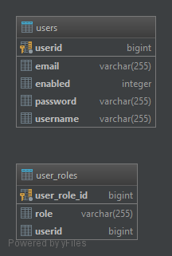
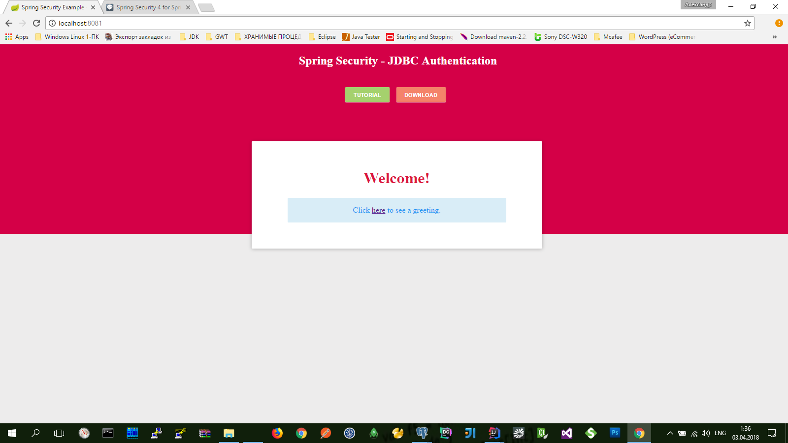
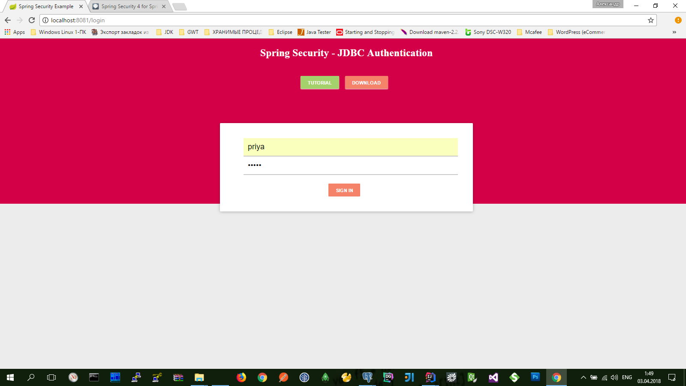
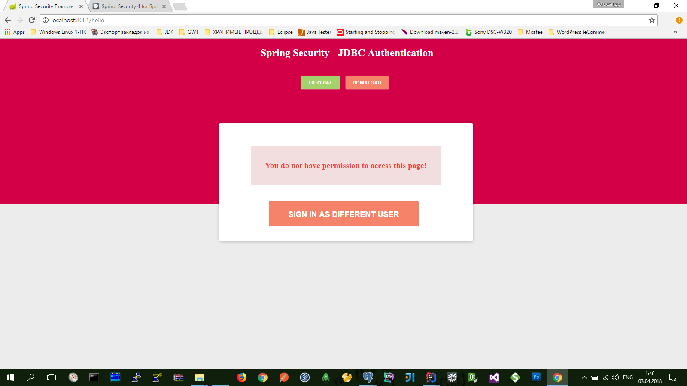
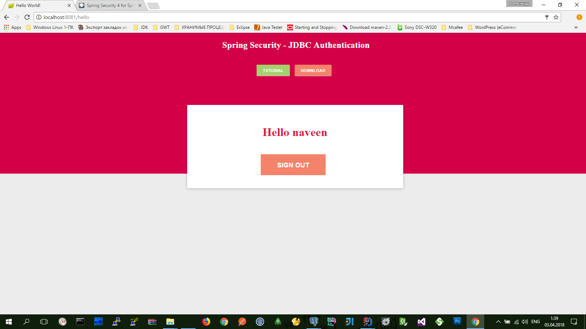

# Spring Security 4 for Spring MVC using Spring Data JPA and Spring Boot

* `Step by Step Guide` http://www.programming-free.com/2016/01/spring-com.security-spring-data-jpa.html
* `Video Tutorial` https://youtu.be/XO-OdIXNU_o
* **(** [Spring Boot Hello World Example – JSP](https://www.mkyong.com/spring-boot/spring-boot-hello-world-example-jsp)  **)**
* **(** [Encoding of properties files](https://www.jetbrains.com/help/idea/properties-files.html) **)**  `Ctrl+Alt+S` >> `Editor` and `File Encodings` >> *Transparent native-to-ascii conversion* and *Default encoding for properties files - select the encoding that will be used*...

```properties
##### PostgreSQL
################### DataSource Configuration ##########################
spring.datasource.driverClassName=org.postgresql.Driver
spring.datasource.url=jdbc:postgresql://localhost:5432/userbase
spring.datasource.username=postgres
spring.datasource.password=postgres
spring.jpa.database-platform=org.hibernate.dialect.PostgreSQLDialect
spring.jpa.show-sql=true

##### Hibernate
spring.jpa.hibernate.ddl-auto=update
```



```sql
INSERT INTO users (userid, username, email, password, enabled) VALUES
  (0, 'priya', 'abc@abc.com', '$2a$04$CO93CT2ObgMiSnMAWwoBkeFObJlMYi/wzzOnPlsTP44r7qVq0Jln2', 1),
  (1, 'naveen', 'def@def.com', '$2a$04$j3JpPUp6CTAe.kMWmdRNC.Wie58xDNPfcYz0DBJxWkucJ6ekJuiJm', 1);

INSERT INTO user_roles (user_role_id, userid, role) VALUES
  (0, 0, 'ROLE_USER'),
  (1, 1, 'ROLE_ADMIN'),
  (2, 1, 'ROLE_USER');
```

```bash
mvn spring-boot:run
```
или
```bash
mvn clean package
java -jar target/spring-boot-web-jsp-1.0.war
```

[http://localhost:8081](http://localhost:8081) >> `priya`:`priya` или `naveen`:`naveen`




###Закрытый доступ для пользователя с правами `ROLE_USER`:

(`priya`:`priya`)





###Открытый доступ для пользователя с правами `ROLE_ADMIN`:

(`naveen`:`naveen`)



